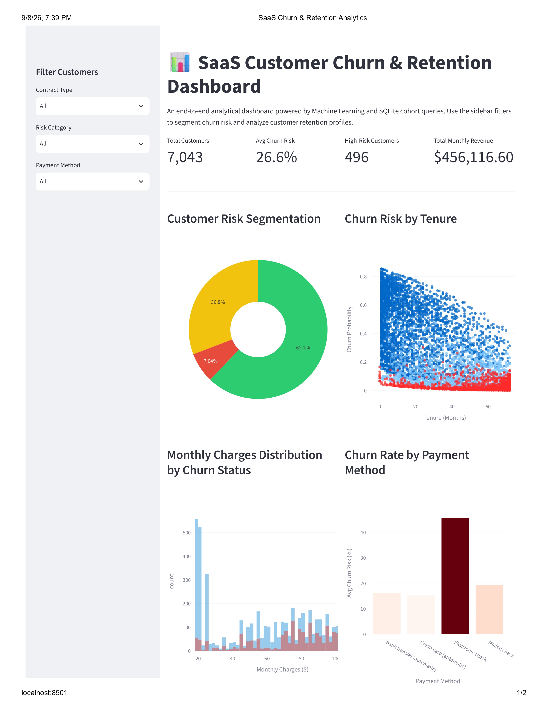
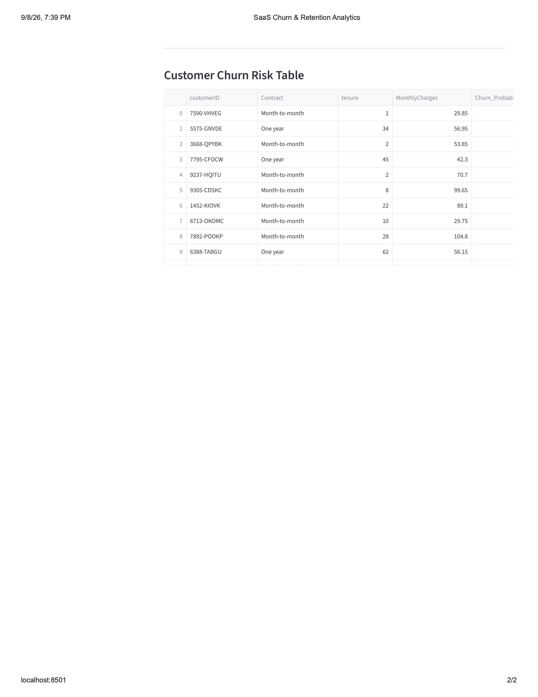

# 📊 SaaS Customer Churn & Retention Analytics Dashboard

**🔗 Repository:** [github.com/Vaishnavi698/saas-churn-retention-dashboard](https://github.com/Vaishnavi698/saas-churn-retention-dashboard)
**🗓️ Last Updated:** September 2026

An end-to-end machine learning, SQL, and Streamlit analytics application designed to predict SaaS customer churn, segment risk profiles, and visualize key customer retention metrics.

**Keywords:** `customer churn prediction` · `saas analytics` · `retention dashboard` · `machine learning` · `logistic regression` · `random forest` · `sql cohort analysis` · `streamlit dashboard` · `plotly visualization` · `python data science` · `churn risk scoring` · `sqlite`

---

## 📌 Project Overview

Customer churn is one of the most critical metrics for SaaS companies. This project provides an end-to-end data pipeline that transforms raw customer usage and billing data into actionable retention strategies through:

- **Predictive ML Modeling** — machine learning pipeline using Logistic Regression / Random Forest to calculate individual customer churn probabilities.
- **SQL Cohort Analytics** — SQLite queries for cohort retention analysis, contract-level aggregations, and revenue risk metrics.
- **Interactive Dashboard** — a multi-chart Streamlit dashboard built with Plotly for real-time risk filtering and KPI tracking.

---

## 🖼️ Dashboard Preview

<table>
  <tr>
    <td></td>
    <td></td>
  </tr>
</table>

*Interactive Streamlit dashboard displaying key metrics ($456K MRR, 26.6% avg churn risk), customer risk segmentation donut chart, and tenure vs. churn risk scatter plots.*

---

## 📁 Repository Structure & File Descriptions

| File / Folder | Type | Description |
|---|---|---|
| `churn_model.py` | Python Script | Loads raw customer data, trains the machine learning model, calculates churn probabilities, and outputs `processed_churn_risk.csv`. |
| `run_queries.py` | Python Script | Connects to `churn_analysis.db` SQLite database, executes cohort SQL queries, and populates risk summary tables. |
| `app.py` | Streamlit App | Interactive web app featuring KPI metrics, Plotly visualizations, contract/risk sidebar filters, and data tables. |
| `processed_churn_risk.csv` | Dataset | Output dataset containing raw features, predicted `Churn_Probability`, and categorized `Risk_Category`. |
| `churn_analysis.db` | SQLite DB | Binary SQLite database containing relational customer tables and pre-computed cohort metrics. |

---

## 🛠️ Tech Stack & Requirements

- **Language:** Python 3.10+
- **Data Processing & ML:** `pandas`, `scikit-learn`, `numpy`
- **Database:** SQLite3
- **Web & Visualization:** `streamlit`, `plotly`
- **Version Control:** Git & GitHub

---

## 🚀 Getting Started

### 1. Clone the Repository

```bash
git clone https://github.com/Vaishnavi698/saas-churn-retention-dashboard.git
cd saas-churn-retention-dashboard
```

---

## 🔧 How to Run the Pipeline & Launch Dashboard

Run the scripts in the following **exact sequence**:

### Step 1: Train ML Pipeline

```powershell
python churn_model.py
```

### Step 2: Populate SQLite Database (creates `churn_analysis.db`)

```powershell
python run_queries.py
```

### Step 3: Launch Streamlit Web App

```powershell
streamlit run app.py
```

---

## 📌 Quick Reference Commands

| Step | Purpose | Command |
|------|----------|---------|
| 1 | Train ML Pipeline | `python churn_model.py` |
| 2 | Populate SQL Database | `python run_queries.py` |
| 3 | Launch Streamlit App | `streamlit run app.py` |

---
